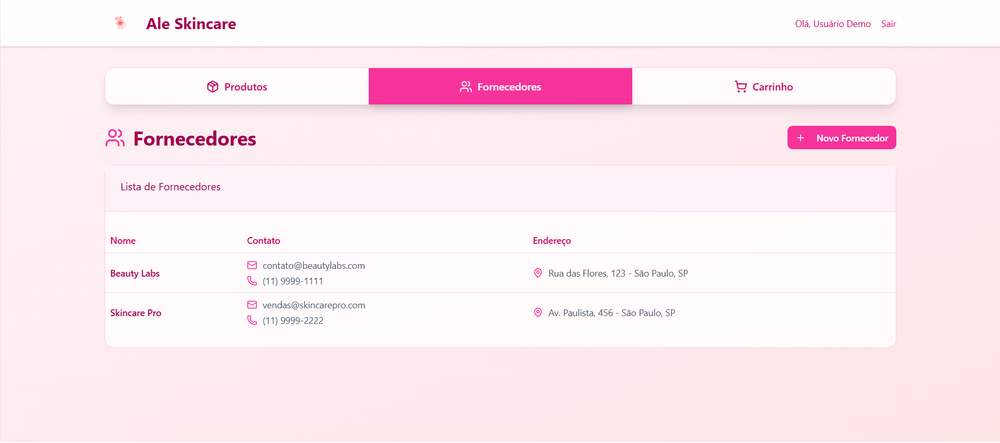
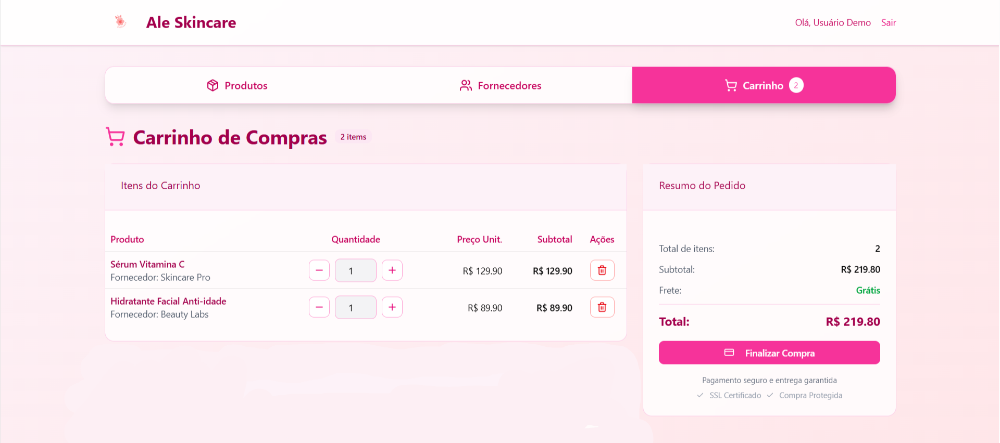

# ALeSkincare
Um sistema de gestão de produtos básico que inclui autenticação, cadastro e manutenção de produtos e fornecedores, e um carrinho de compras.

## Telas Figma

### Tela de Login
Permite que o usuário faça login no sistema, informando seu e-mail e sua senha.

### Tela de cadastro de usuário
Permite que o usuário que nunca acessou a página faça cadastro, para ter acesso aos produtos disponíveis.

### Tela de produtos
Após autenticação do usuário, o site mostra os produtos disponíveis e dá as opções de adicionar novo, editar, ou adicionar ao carrinho.

### Tela de cadastro de produtos
Ao selecionar a opção "Novo produto", aparecem os campos para preenchimento do novo produto.

### Tela de fornecedores
Onde é possível ver os fornecedores dos produtos

### Tela de cadastro de fornecedores
Ao selecionar a opção "Novo fornecedor", aparecem os campos para preenchimento do novo fornecedor.

### Tela de carrinho
Onde é possível ver os produtos adicionados ao carrinho.
Quando vazio:

Quando possui produtos:

<3